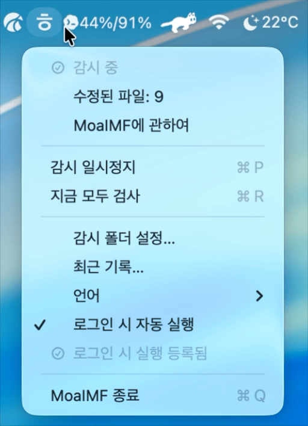
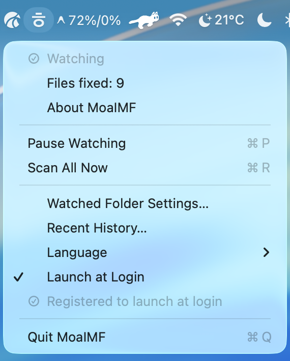
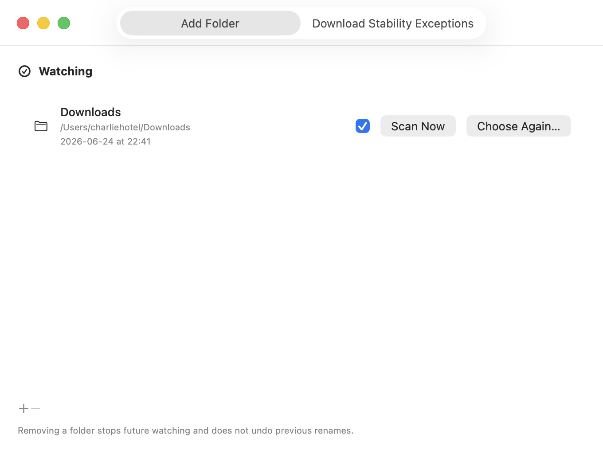
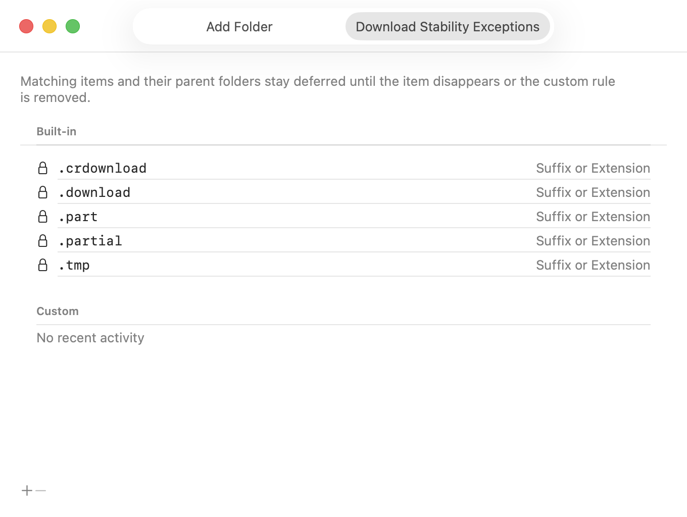
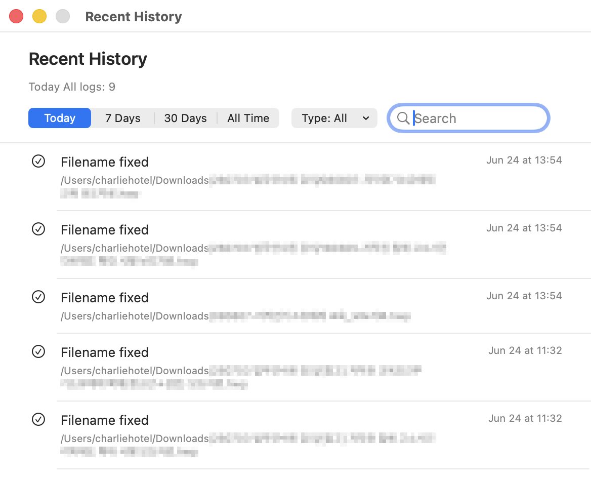
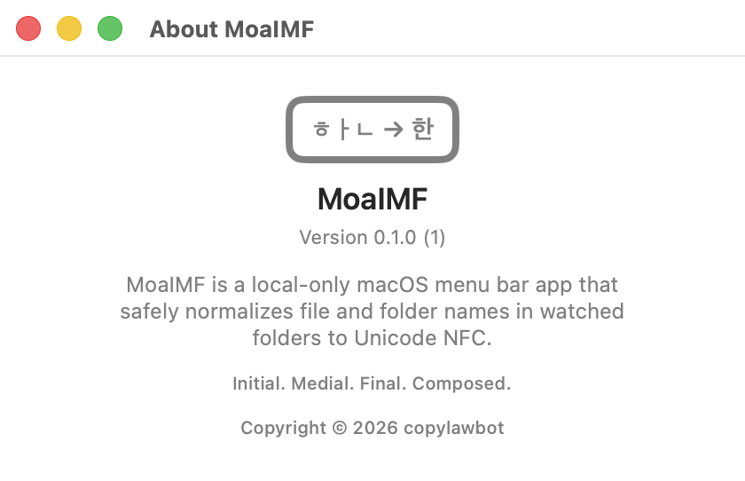

<p align="center">
  <a href="README.md">🇰🇷 한국어</a> | <a href="README.en.md">🇺🇸 English</a> | <a href="README.ja.md">🇯🇵 日本語</a> | <a href="README.zh-Hans.md">🇨🇳 简体中文</a> | <a href="README.zh-Hant.md">🇹🇼 繁體中文</a> | <a href="README.vi.md">🇻🇳 Tiếng Việt</a>
  <br>
  <a href="README.fr.md">🇫🇷 Français</a> | <a href="README.de.md">🇩🇪 Deutsch</a> | <a href="README.es.md">🇪🇸 Español</a> | <a href="README.pt.md">🇵🇹 Português</a> | <a href="README.th.md">🇹🇭 ไทย</a> | <a href="README.ar.md">🇸🇦 العربية</a>
</p>

<p align="center">
  
</p>

<h1 align="center">MoaIMF</h1>

<p align="center">
  <strong>Initial. Medial. Final. Composed.</strong><br>
  Eine macOS-Menüleisten-App, die zerlegte Unicode-Dateinamen sicher in NFC-Namen normalisiert
</p>

<p align="center">
  <a href="#überblick">Überblick</a> ·
  <a href="#verwendung">Verwendung</a> ·
  <a href="#installation-und-build">Installation und Build</a> ·
  <a href="#sicherheit-und-datenschutz">Sicherheit</a> ·
  <a href="#entwicklung">Entwicklung</a>
</p>

## Überblick

MoaIMF ist eine macOS-Menüleisten-App, die Datei- und Ordnernamen in vom Benutzer ausgewählten Ordnern nach Unicode NFC normalisiert. Der Name beschreibt das Zusammensetzen von Initial, Medial und Final einer Hangul-Silbe zu einer zusammengesetzten Form.

Unter macOS können koreanische Dateinamen nach dem Durchlaufen von Dateisystemen, Apps, Download-Tools, Entpackern, externen Laufwerken, NAS oder Cloud-Sync-Tools in einer NFD-ähnlichen zerlegten Form gespeichert werden. Finder zeigt dann möglicherweise `한글.txt`, während Alfred, Terminalsuche oder Automationsskripte `ㅎㅏㄴㄱㅡㄹ.txt` sehen und die Datei nicht finden.

MoaIMF ist kein einmaliges Cleanup-Skript. Es ist ein lokales Dienstprogramm, das genehmigte Ordner kontinuierlich überwacht und Namensprobleme bei neu erstellten oder heruntergeladenen Dateien behebt.

## Screenshots

Während der Überwachung wechselt das Menüleistensymbol durch `ㅎ`, `ㅏ`, `ㄴ`, `한`. Bei pausierter Überwachung bleibt es bei `ㅎ`.

<table>
  <tr>
    <td align="center" width="50%">
      <kbd></kbd>
    </td>
    <td align="center" width="50%">
      <kbd></kbd>
    </td>
  </tr>
</table>

### Überwachte Ordner

<kbd></kbd>

Die Einstellungen starten standardmäßig mit `Downloads`. Mit `+` und `-` können überwachte Ordner hinzugefügt oder entfernt werden. Jeder Ordner kann einzeln aktiviert oder deaktiviert werden.

### Download-Stabilitätsausnahmen

<kbd></kbd>

Dateien im Download können noch keinen endgültigen Namen haben oder weiterhin Größe und Änderungszeit ändern. MoaIMF bietet gesperrte Regeln für `.crdownload`, `.download`, `.part`, `.partial`, `.tmp` und erlaubt eigene Ausnahmeregeln.

### Verlauf

<kbd></kbd>

Der Verlauf kann nach Heute, 7 Tagen, 30 Tagen oder Gesamtzeit angezeigt und nach Umbenennungen, Konflikten, Berechtigungen oder Fehlern gefiltert werden.

```text
~/Library/Containers/<app bundle identifier>/Data/Library/Application Support/MoaIMF/history.jsonl
```

### Info

<kbd></kbd>

Das About-Fenster zeigt App-Name, Version, Kurzbeschreibung und Copyright. Die Grafik zeigt, wie zerlegte Jamo wie `ㅎㅏㄴ -> 한` zu einem zusammengesetzten Zeichen werden.

## Funktionen

- Status in der Menüleiste prüfen, pausieren, fortsetzen und beenden
- Downloads als Standardordner verwenden
- Mehrere überwachte Ordner mit `+` und `-` verwalten
- Ordner rekursiv scannen
- Nur vom Benutzer ausgewählte Ordner per security-scoped bookmarks öffnen
- Änderungen mit FSEvents erkennen
- Dateien erst nach stabiler Größe und Änderungszeit verarbeiten
- Bei möglichen Konflikten nie automatisch überschreiben
- Verlauf lokal speichern
- Keine externe Serverkommunikation, kein Konto, keine Telemetrie

## Funktionsweise

MoaIMF verändert keine Dateiinhalte. Es bearbeitet nur die Unicode-Normalisierungsform von Datei- und Ordnernamen.

Der Ablauf: Ordner auswählen, Berechtigung als Bookmark speichern, Änderungen über FSEvents erkennen, Ausnahmen und Stabilität prüfen, NFC-Zielnamen berechnen, Konflikte prüfen, Dateidentität vor und nach dem Rename verifizieren und das Ergebnis im Verlauf speichern.

MoaIMF führt konfliktverdächtige Dateien nicht automatisch zusammen und erzeugt keine Namen wie `-1`, `copy` oder `복사본`. Fälle, die eine Entscheidung erfordern, bleiben im Verlauf und in Benachrichtigungen.

## Verwendung

1. `MoaIMF.app` starten; das Symbol erscheint in der Menüleiste.
2. `Watched Folder Settings...` öffnen und Ordner hinzufügen.
3. Beim ersten Hinzufügen `Normalize Existing Items` oder `Watch New Items Only` wählen.
4. Mit `Pause Watching` und `Resume Watching` pausieren oder fortsetzen.
5. Mit `Scan All Now` oder `Scan Now` manuell scannen.
6. Die Sprache im Menü `Language` wählen.
7. `Launch at Login` aktivieren, wenn MoaIMF beim Login starten soll.
8. Mit `Quit MoaIMF` beenden.

Die Sprachen sind KI-Übersetzungen zur Vereinfachung. Fehler oder zusätzliche Sprachwünsche bitte über `Issues` melden.

## Installation und Build

Laden Sie `MoaIMF.dmg` aus GitHub Releases herunter, öffnen Sie es und kopieren Sie `MoaIMF.app` nach `/Applications`. Die Release-App ist noch nicht mit Developer ID signiert oder von Apple notarisiert. Wenn macOS sie blockiert und Sie dem Download vertrauen, entfernen Sie das Quarantäne-Attribut und öffnen Sie die App.

```sh
xattr -dr com.apple.quarantine /Applications/MoaIMF.app
open /Applications/MoaIMF.app
```

Aus dem Quellcode bauen:

```sh
git clone https://github.com/charliehotel/MoaIMF.git
cd MoaIMF
scripts/check.sh
open .build/MoaIMF.app
```

Voraussetzungen: macOS 13 Ventura oder neuer, Xcode 16 oder kompatible Command Line Tools, Swift 6 toolchain, Git. Nur den App-Bundle bauen:

```sh
scripts/build-app.sh
```

## Lokaler Datenort

MoaIMF speichert App-Zustand und Verlauf in Application Support innerhalb des macOS-App-Sandbox-Containers.

```text
~/Library/Containers/<app bundle identifier>/Data/Library/Application Support/MoaIMF/
```

Wichtige Dateien sind `watched-folders.json`, `stability-rules.json`, `history.jsonl` und `recovery/`. Einige Einstellungen liegen auch in `UserDefaults`.

## Sicherheit und Datenschutz

MoaIMF ändert nur Namen. Es liest oder verändert keine Dateiinhalte, greift nur auf ausgewählte Ordner zu, folgt keinen Symlinks, scannt keine Pakete wie `.app` oder `.photoslibrary`, prüft Konflikte und arbeitet vollständig lokal. Keine Netzwerkverbindung, kein Konto, keine Analytics, keine Telemetrie.

## Einschränkungen

MoaIMF ändert nicht die systemweite Dateinamenspeicherung von macOS, zwingt Apps nicht zu NFC, löst Konflikte nicht automatisch, baut Spotlight- oder Alfred-Indizes nicht direkt neu und konzentriert sich aktuell auf Quell-Builds.

## Deinstallation

1. `Launch at Login` deaktivieren.
2. `Quit MoaIMF` auswählen.
3. `MoaIMF.app` löschen.
4. Für lokale Daten den MoaIMF-Application-Support-Ordner im App-Container löschen.

```text
~/Library/Containers/<app bundle identifier>/Data/Library/Application Support/MoaIMF/
```

Bereits nach NFC geänderte Dateinamen werden dadurch nicht zu NFD zurückgesetzt.

## Entwicklung

Das Projekt basiert auf Swift Package Manager.

```sh
xcrun swift-format lint --strict --recursive Sources Tests Package.swift
swift test
swift build
scripts/build-app.sh
```

- [v0.1 Design-Spezifikation](../docs/superpowers/specs/2026-06-21-moaimf-v0.1-design.md)
- [v0.1 Implementierungsplan](../docs/superpowers/plans/2026-06-21-moaimf-v0.1.md)
- [Contributing Guide](../CONTRIBUTING.md)
- [Security Policy](../SECURITY.md)

## Lizenz

MoaIMF wird unter der [MIT License](../LICENSE) verteilt.
