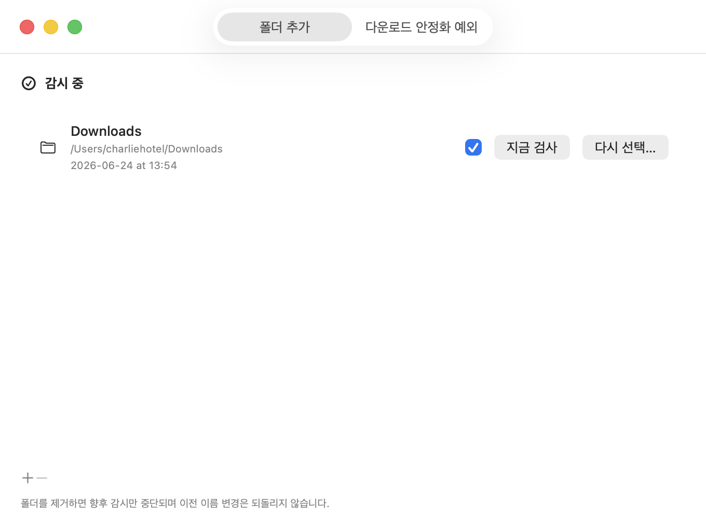
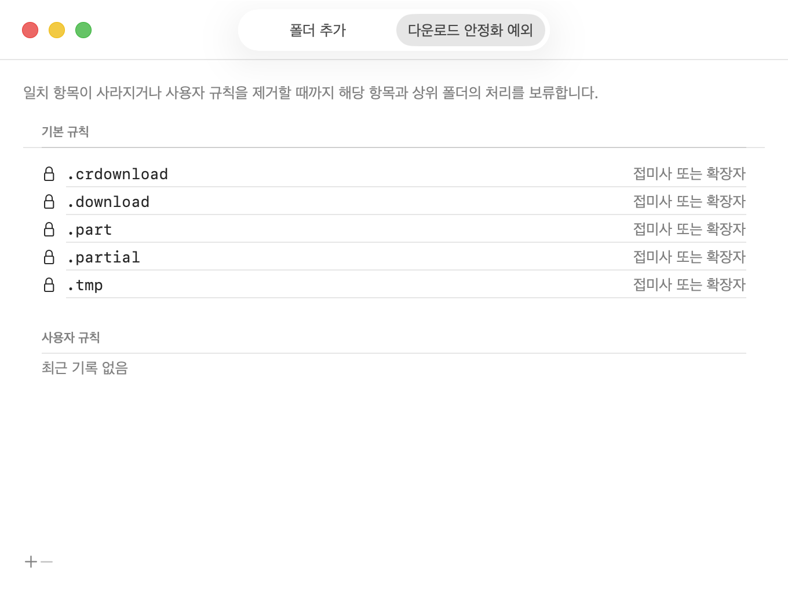
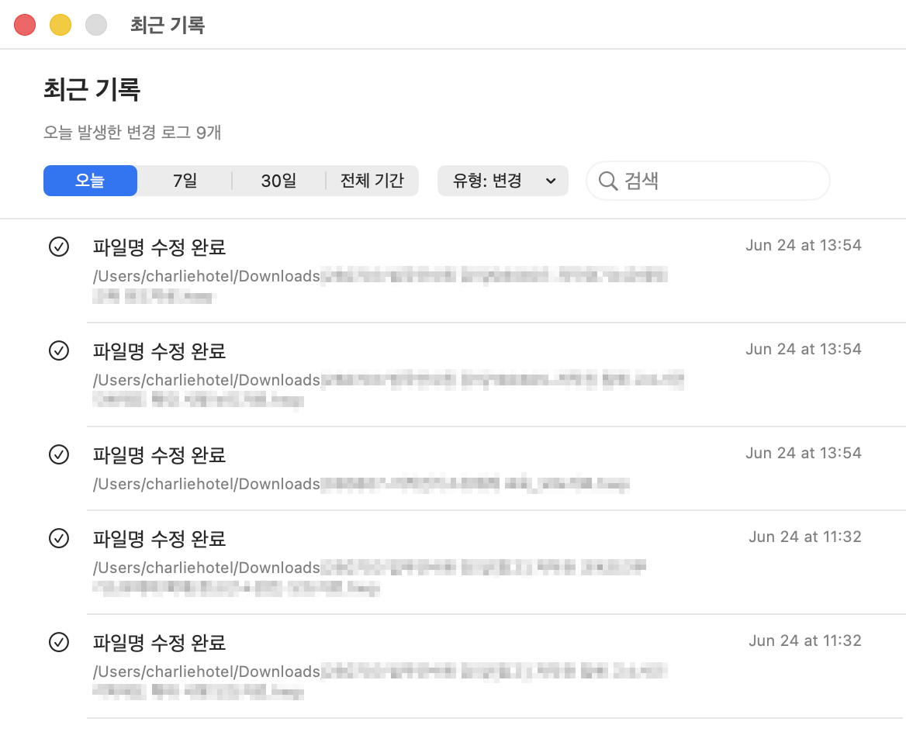
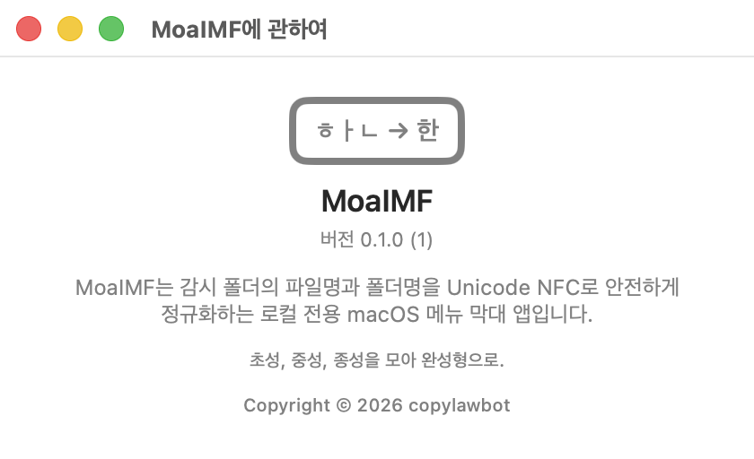

<p align="center">
  <a href="README.md">🇰🇷 한국어</a> | <a href="README.en.md">🇺🇸 English</a> | <a href="README.ja.md">🇯🇵 日本語</a> | <a href="README.zh-Hans.md">🇨🇳 简体中文</a> | <a href="README.zh-Hant.md">🇹🇼 繁體中文</a> | <a href="README.vi.md">🇻🇳 Tiếng Việt</a>
  <br>
  <a href="README.fr.md">🇫🇷 Français</a> | <a href="README.de.md">🇩🇪 Deutsch</a> | <a href="README.es.md">🇪🇸 Español</a> | <a href="README.pt.md">🇵🇹 Português</a> | <a href="README.th.md">🇹🇭 ไทย</a> | <a href="README.ar.md">🇸🇦 العربية</a>
</p>

<p align="center">
  
</p>

<h1 align="center">MoaIMF</h1>

<p align="center">
  <strong>Initial. Medial. Final. Composed.</strong><br>
  macOS에서 분리된 유니코드 파일명을 NFC 완성형 이름으로 안전하게 정리하는 메뉴 막대 앱
</p>

<p align="center">
  <a href="#주요-기능">주요 기능</a> ·
  <a href="#사용-방법">사용 방법</a> ·
  <a href="#설치와-빌드">설치와 빌드</a> ·
  <a href="#안전성과-개인정보-보호">안전성</a> ·
  <a href="#개발">개발</a>
</p>

## 소개

MoaIMF는 사용자가 지정한 폴더의 파일명과 폴더명을 Unicode NFC로 정규화하는 macOS 메뉴 막대 앱입니다. 이름은 한글 음절을 이루는 초성(Initial), 중성(Medial), 종성(Final)을 모아 완성형(Composed)으로 만든다는 뜻입니다.

macOS에서는 파일시스템, 앱, 다운로드 도구, 압축 해제 도구, 외장 저장장치, NAS, 클라우드 동기화 도구를 거치며 한글 파일명이 NFD처럼 분리된 형태로 저장될 수 있습니다. 그러한 경우, Finder에서는 `한글.txt`처럼 보이지만 Alfred, 터미널 검색, 일부 자동화 스크립트 등에서는 `ㅎㅏㄴㄱㅡㄹ.txt`로 인식해서 파일이 검색되지 않는 일이 생깁니다.

MoaIMF는 이 문제를 “한 번 고치는 일회성 스크립트”로 보지 않습니다. 사용자가 승인한 폴더를 지속적으로 모니터링하며 새로 생성되거나 다운로드 받은 파일의 이름 문제를 해결하는 로컬 전용 유틸리티입니다.

## 화면

메뉴 막대 앱의 메인 화면입니다. 폴더를 모니터링 중일 때는 메뉴 막대의 아이콘이 `ㅎ`, `ㅏ`, `ㄴ`, `한` 순서로 변경됩니다. 모니터링을 정지할 경우, 아이콘은 `ㅎ`에서 멈춥니다.

<table>
  <tr>
    <td align="center" width="50%">
      <kbd></kbd>
    </td>
    <td align="center" width="50%">
      <kbd></kbd>
    </td>
  </tr>
</table>

### 감시 폴더 설정

<kbd></kbd>

감시 폴더 설정은 기본값인 `Downloads` 폴더에서 시작합니다. 사용자는 `+`와 `-` 버튼으로 감시 폴더를 추가하거나 제거합니다. 각 폴더는 따로 활성화하거나 비활성화하고, 권한이 끊어진 폴더는 다시 선택합니다.

폴더별 `지금 검사`를 누르면 해당 폴더를 즉시 스캔합니다. 스캔 결과에는 NFC 항목, NFD 후보, 충돌, 보류 항목 등이 표시되므로 버튼을 눌렀을 때 무엇이 확인되었는지 바로 확인합니다.

### 다운로드 안정화 예외

<kbd></kbd>

다운로드 중인 파일은 이름이 아직 확정되지 않았거나 파일 크기와 수정 시간이 계속 바뀌는 상태일 수 있습니다. MoaIMF는 `.crdownload`, `.download`, `.part`, `.partial`, `.tmp` 같은 기본 규칙을 잠긴 규칙으로 제공하며, 사용자가 직접 예외 규칙을 추가하게 합니다.

지원하는 사용자 규칙은 다음과 같습니다.

- 정확한 파일명
- 접미사 또는 확장자
- 마지막 경로 구성요소에 대한 `*`, `?` 글로브

예외 규칙에 걸린 항목은 규칙이 제거되거나 해당 항목이 사라질 때까지 처리하지 않습니다. 예외 항목을 포함한 상위 폴더도 함께 보류해 다운로드 중인 폴더를 성급하게 이름 변경하지 않도록 합니다.

### 최근 기록

<kbd></kbd>

최근 기록은 오늘, 7일, 30일, 전체 기간 단위로 볼 수 있으며 변경·충돌·권한·오류 유형으로 필터링합니다. 검색창은 파일 경로, 처리 사유, 이벤트 제목, 루트 식별자를 대상으로 검색하고, NFC/NFD 철자 차이를 같은 사용자 입력으로 취급하도록 정규화 변형도 함께 비교합니다.

기록은 로컬 JSONL 파일로 저장됩니다.

```text
~/Library/Containers/<앱 번들 식별자>/Data/Library/Application Support/MoaIMF/history.jsonl
```

기록은 기본적으로 30일 동안 보관됩니다. 새 기록을 추가할 때 보관 기간을 지난 항목은 정리됩니다.

### 앱 정보

<kbd></kbd>

About 창에는 앱 이름, 버전, 간단한 설명, 저작권 표시가 나옵니다. 상단 이미지는 `ㅎㅏㄴ → 한`처럼 분리된 자모가 완성형 글자로 합쳐지는 개념을 보여줍니다.

## 주요 기능

- 메뉴 막대에서 감시 상태를 확인하고 일시정지, 재개, 종료 가능
- 기본 감시 위치로 Downloads 사용
- `+`와 `-`로 여러 감시 폴더 추가·삭제
- 감시 폴더와 하위 폴더를 재귀적으로 검사
- 사용자가 선택한 폴더만 보안 범위 북마크로 접근
- 새 파일 또는 변경된 경로를 FSEvents로 감지
- 파일 크기와 수정 시간이 일정 시간 안정된 뒤에만 처리
- 다운로드 중간 파일과 사용자 지정 예외 규칙 보류
- 파일명과 폴더명을 Unicode NFC로 정규화
- 충돌 가능성이 있으면 자동 덮어쓰기 금지
- 직접 rename 검증 후 실패하면 복구 가능한 임시 이름 전략 사용
- 변경, 충돌, 권한, 연결 해제, 파일시스템 오류를 최근 기록에 저장
- 오늘 수정된 파일 수를 메뉴에 표시하고 최근 기록으로 이동
- 앱 처음 실행 시 메뉴 막대 아이콘을 찾는 안내 팝업 표시
- 로그인 시 자동 실행 등록 상태 표시
- 앱 내부 언어 선택 지원
- 외부 서버 통신, 계정, 텔레메트리 없음

## 어떻게 동작하나

MoaIMF는 “파일 내용”을 바꾸지 않습니다. 파일명과 폴더명의 유니코드 정규화 형태만 다룹니다.

처리 흐름은 다음과 같습니다.

1. 사용자가 감시 폴더를 선택합니다.
2. 앱은 해당 폴더 접근 권한을 보안 범위 북마크로 저장합니다.
3. FSEvents가 새 파일, 새 폴더, 이름 변경, 다운로드 완료 같은 변화를 알려줍니다.
4. 스캔 서비스가 해당 경로와 하위 항목을 검사합니다.
5. 예외 규칙, 패키지, 심볼릭 링크 대상, 권한 문제, 파일 안정화 상태를 확인합니다.
6. NFD 등 NFC가 아닌 이름을 발견하면 NFC 목표 이름을 계산합니다.
7. 같은 폴더 안에 정규화 후 같은 이름이 되는 항목이 있는지 충돌을 검사합니다.
8. 충돌이 없고 안정화된 항목만 이름 변경 후보가 됩니다.
9. 변경 직전 파일 정체성을 다시 확인하고 rename을 수행합니다.
10. 변경 후 실제 파일명이 NFC 바이트로 보존되었는지 검증합니다.
11. 결과를 최근 기록에 저장하고 메뉴의 오늘 수정 수를 갱신합니다.

이 구조 때문에 MoaIMF는 충돌이 의심되는 파일을 임의로 병합하지 않고, `-1`, `copy`, `복사본` 같은 새 이름도 자동으로 만들지 않습니다. 사용자가 직접 판단해야 하는 상황은 최근 기록과 알림으로 남깁니다.

## 사용 방법

### 1. 앱 실행

`MoaIMF.app`을 실행하면 Dock에 일반 앱처럼 오래 머무르지 않고 메뉴 막대에 아이콘이 표시됩니다. 메뉴 막대 아이콘이 많거나 MacBook 노치 뒤에 가려질 수 있어 처음 실행할 때 안내 창을 띄웁니다.

### 2. 감시 폴더 설정

메뉴에서 `감시 폴더 설정...`을 엽니다. 기본 폴더는 Downloads입니다. 필요하면 `+` 버튼으로 다른 폴더를 추가합니다.

권장 사용 방식은 다음과 같습니다.

- 다운로드 폴더처럼 새 파일이 자주 생기는 위치는 감시 대상으로 등록합니다.
- 프로젝트 소스, 사진 보관함, 앱 번들처럼 구조가 민감한 위치는 꼭 필요할 때만 등록합니다.
- 외장 디스크나 NAS 동기화 폴더는 먼저 소량의 파일로 테스트합니다.

### 3. 기존 항목 처리 방식 선택

처음 폴더를 추가할 때는 기존 항목까지 바로 바꿀지, 앞으로 생기는 항목만 감시할지 선택합니다.

- `기존 항목 정규화`: 현재 폴더 안에 이미 존재하는 Non-NFC 이름도 검사하고 승인된 후보를 변경합니다.
- `새 항목만 감시`: 기존 파일명은 그대로 두고, 이후 새로 생기거나 변경되는 항목부터 처리합니다.

기존 파일이 많은 폴더라면 먼저 스캔 결과를 확인한 뒤 처리하는 편이 안전합니다.

### 4. 일시정지와 재개

메뉴의 `감시 일시정지`를 누르면 감시와 자동 이름 변경이 멈춥니다. 설정, 기록, 폴더 목록은 유지됩니다. 일시정지 중에는 메뉴 막대 아이콘 애니메이션도 멈추고 초기 프레임을 표시합니다.

다시 처리하려면 `감시 재개`를 선택합니다.

### 5. 즉시 검사

메뉴의 `지금 모두 검사`는 등록된 감시 폴더 전체를 다시 스캔합니다. 감시 폴더 설정 화면에서 각 행의 `지금 검사`를 누르면 해당 폴더만 검사합니다.

즉시 검사는 다음 상황에 유용합니다.

- 앱이 꺼져 있는 동안 파일이 추가된 경우
- 외장 디스크를 다시 연결한 경우
- 예외 규칙을 바꾼 뒤 보류된 항목을 다시 확인하고 싶은 경우
- 최근 기록의 결과와 실제 폴더 상태를 비교하고 싶은 경우

### 6. 언어 변경

메뉴의 `언어`에서 앱 표시 언어를 직접 선택합니다. 현재 수동 선택 가능한 언어는 다음과 같습니다.

- 시스템 설정
- English
- 한국어
- 日本語
- 简体中文
- 繁體中文
- Tiếng Việt
- Français
- Deutsch
- Español
- Português
- ไทย
- العربية

제공되는 언어는 편의를 위한 AI 번역입니다. 잘못 번역된 사항이나 추가로 제공해 주었으면 하는 언어가 있으면 `Issues`를 통해서 알려주세요.

### 7. 로그인 시 자동 실행

메뉴에서 `로그인 시 자동 실행`을 켜면 macOS 로그인 항목에 MoaIMF를 등록합니다. 메뉴에는 등록 여부도 함께 표시됩니다. macOS가 사용자 승인을 요구하면 시스템 설정을 열어 승인해야 합니다.

### 8. 종료

`MoaIMF 종료`를 선택하면 감시 작업과 보안 범위 접근을 정리한 뒤 앱이 종료됩니다. 별도 daemon이나 helper 프로세스는 남기지 않습니다.

## 설치와 빌드

현재는 소스 빌드 기반 설치를 전제로 합니다. Developer ID 서명과 Apple 공증을 거친 배포 파일은 아직 제공하지 않습니다.

### 요구 사항

- macOS 13 Ventura 이상
- Xcode 16 이상 또는 호환되는 Xcode Command Line Tools
- Swift 6 toolchain
- Git

빌드 스크립트는 macOS 기본 도구도 사용합니다.

- `swift`
- `xcrun swift-format`
- `sips`
- `python3`
- `codesign`
- `ditto`

런타임에는 별도 서버, 데이터베이스, 네트워크 API가 필요하지 않습니다.

### 저장소 받기

```sh
git clone https://github.com/charliehotel/MoaIMF.git
cd MoaIMF
```

저장소 주소는 실제 공개 위치에 맞게 조정될 수 있습니다.

### 검사와 빌드

전체 검사, 테스트, 앱 번들 생성을 한 번에 실행하려면 다음 명령을 사용합니다.

```sh
scripts/check.sh
```

앱 번들만 만들려면 다음 명령을 사용합니다.

```sh
scripts/build-app.sh
```

생성된 앱은 다음 위치에 만들어집니다.

```text
.build/MoaIMF.app
```

로컬에서 실행하려면:

```sh
open .build/MoaIMF.app
```

`scripts/build-app.sh`가 만든 앱은 로컬 테스트용 ad-hoc 서명 앱입니다. 다른 Mac에 배포하려면 Developer ID 서명과 notarization을 별도로 구성해야 합니다.

## 로컬 데이터 위치

MoaIMF는 앱 상태와 기록을 macOS 앱 샌드박스 컨테이너 안의 Application Support에 저장합니다.

```text
~/Library/Containers/<앱 번들 식별자>/Data/Library/Application Support/MoaIMF/
```

`<앱 번들 식별자>` 부분은 설치된 앱 빌드에 포함된 번들 식별자에 따라 달라집니다.

주요 파일은 다음과 같습니다.

| 파일 | 설명 |
|---|---|
| `watched-folders.json` | 감시 폴더 목록, 활성화 상태, 보안 범위 북마크 |
| `stability-rules.json` | 다운로드 안정화 기본 규칙과 사용자 예외 규칙 |
| `history.jsonl` | 최근 처리 기록 |
| `recovery/` | 이름 변경 도중 실패했을 때 복구하기 위한 저널 |

앱 설정 일부는 `UserDefaults`에도 저장됩니다. 예를 들어 일시정지 상태, 언어 선택, 첫 실행 안내 숨김 여부가 여기에 포함됩니다.

## 안전성과 개인정보 보호

MoaIMF의 기본 원칙은 “안전하게 이름만 바꾸고, 모르면 멈춘다”입니다.

- 파일 내용은 읽거나 수정하지 않습니다.
- 사용자가 선택한 폴더에만 접근합니다.
- 보안 범위 북마크를 사용해 macOS 권한 모델을 따릅니다.
- `.app`, `.bundle`, `.framework`, `.photoslibrary` 같은 패키지 내부는 검사하지 않습니다.
- 심볼릭 링크의 대상은 따라가지 않습니다.
- 정규화 후 같은 이름이 되는 형제 항목이 있으면 변경하지 않습니다.
- 변경 전후 파일 정체성을 검증합니다.
- 검증된 NFC 이름을 파일시스템이 보존하지 않으면 해당 상황을 오류로 기록합니다.
- 모든 처리는 로컬에서 이루어집니다.
- 네트워크 통신, 계정 로그인, 분석 이벤트, 텔레메트리는 없습니다.

## 제한 사항

- MoaIMF는 macOS 전체의 파일명 저장 방식을 바꾸지 않습니다.
- 모든 앱이 파일명을 NFC로 저장하도록 강제하지 않습니다.
- 충돌 파일을 자동 병합하거나 새 이름으로 해결하지 않습니다.
- Spotlight 또는 Alfred 인덱스를 직접 재생성하지 않습니다.
- 파일시스템, 동기화 도구, 외장 저장장치가 이름 바이트를 다시 바꾸면 앱이 모든 상황을 자동 복구하지는 못합니다.
- 현재는 소스 빌드와 로컬 테스트용 앱 번들을 중심으로 동작합니다.
- 자동 업데이트, App Store 배포, 공증된 DMG 배포는 아직 없습니다.

## 제거

1. 메뉴에서 `로그인 시 자동 실행`을 끕니다.
2. 메뉴에서 `MoaIMF 종료`를 선택합니다.
3. 설치한 `MoaIMF.app`을 삭제합니다.
4. 로컬 상태까지 지우려면 앱 컨테이너 안의 MoaIMF Application Support 폴더를 삭제합니다.

```text
~/Library/Containers/<앱 번들 식별자>/Data/Library/Application Support/MoaIMF/
```

`<앱 번들 식별자>` 부분은 설치된 앱 빌드에 포함된 번들 식별자에 따라 달라집니다.

이 작업은 이미 NFC로 변경된 파일명을 NFD로 되돌리지 않습니다.

## 개발

프로젝트는 Swift Package Manager 기반입니다.

```text
Sources/
  MoaIMFCore/   정규화, 스캔, 감시, 저장소, 안전한 rename 엔진
  MoaIMFUI/     AppController, 메뉴, 설정, 기록, About, 로컬라이제이션
  MoaIMFApp/    macOS 앱 진입점과 메뉴 막대 라벨
Tests/
  MoaIMFCoreTests/
  MoaIMFUITests/
```

자주 쓰는 명령은 다음과 같습니다.

```sh
xcrun swift-format lint --strict --recursive Sources Tests Package.swift
swift test
swift build
scripts/build-app.sh
```

sandbox나 캐시 권한 문제를 줄이려면 `scripts/check.sh`를 사용하는 편이 좋습니다. 이 스크립트는 SwiftPM 캐시와 모듈 캐시를 `.build/` 아래로 지정합니다.

설계 문서는 다음 파일을 참고하세요.

- [v0.1 설계 명세](../docs/superpowers/specs/2026-06-21-moaimf-v0.1-design.md)
- [v0.1 구현 계획](../docs/superpowers/plans/2026-06-21-moaimf-v0.1.md)
- [기여 안내](../CONTRIBUTING.md)
- [보안 정책](../SECURITY.md)

## 라이선스

MoaIMF는 [MIT License](../LICENSE)로 배포됩니다.
